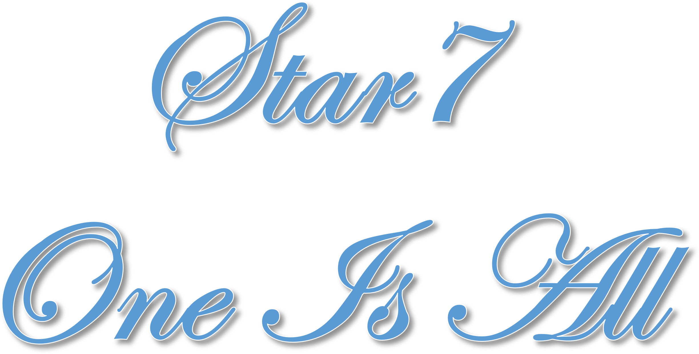

### Hi! 👋 I'm Star

  

## 🚀 **About Me**
💻 Open Source Enthusiast | 📚 Lifelong Learner | 🏀 NBA Fan

🔭 Currently identity: [Student]

🌱 Learning: Python, React & Cloud Technologies

👯 Looking to collaborate on interesting open source projects

⚡ Fun fact: Can name all NBA champions since 2000!

## 🛠️ **Tech Stack**

## 📈 **GitHub Stats**

  
  

## 🎮 **Fun Stats**

  
   
  
   
  <em>✨ Another day, another opportunity to learn something new! ✨</em>

## 📬 **Connect With Me**

  
  
  

## 📖 **Latest Blog Posts**
<!-- Add your blog post links here using https://github.com/gautamkrishnar/blog-post-workflow -->
